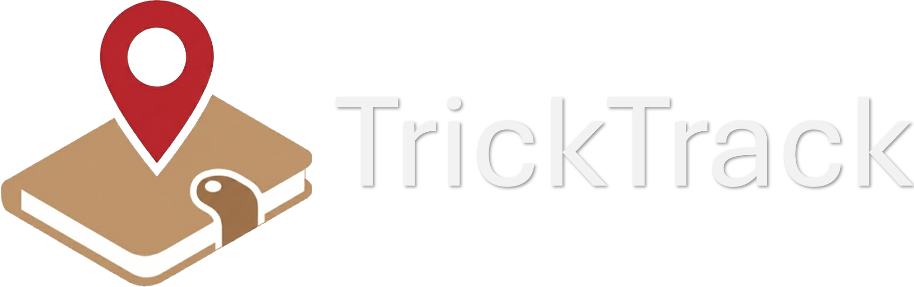
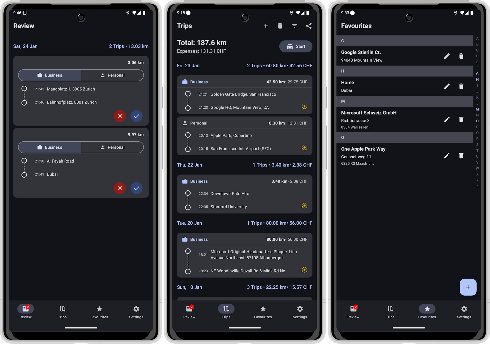

    

**TrickTrack** is a smart, automated GPS mileage tracker for Android built with modern Jetpack Compose. It automatically detects when you are driving - either via Bluetooth connection or movement activity - and logs your trips effortlessly. Designed for privacy and battery efficiency.

---

## 📑 Table of Contents

* [✨ Key Features](#-key-features)
* [💡 Motivation](#-motivation)
* [🛠️ Tech Stack](#%EF%B8%8F-tech-stack)
* [🚀 Installation & Setup](#-installation--setup)
* [📸 Usage](#-usage)
* [📖 Documentation & Help](#-documentation--help)
* [⚠️ Disclaimer & Development Status](#%EF%B8%8F-disclaimer--development-status)
* [⚖️ License & Attribution](#%EF%B8%8F-license--attribution)
---

## ✨ Key Features

### 🧠 Smart Automation
* **Bluetooth Trigger:** Automatically starts tracking when connected to specific devices (e.g., Car Audio).
* **Activity Recognition:** Detects when you are in a vehicle and starts tracking automatically.
* **Stillness Detection:** Intelligently stops the trip when you park and stop moving.
* **Scheduling:** Set specific times or days when automation is allowed (e.g., "Work Hours Only") and save power, when tracking is disabled.

### 📍 Accurate Tracking
* **Live Distance:** Visual real-time distance updates in the notification shade.
* **Foreground Service:** Ensures reliable tracking even when the app is in the background.
* **Smart Suggestions:** Uses the **Photon API (OpenStreetMap)** to auto-fill place names (e.g., "Starbucks") instead of just raw addresses.

### 💰 Reporting & Finances
* **Expense Tracking:** Automatically calculates trip costs based on customizable mileage rates.
* **Advanced Filtering:** Easily filter your history by Date, Keywords, or Trip Type to find exactly what you need.
* **Export Data:** Export your trip logs to **PDF** or **CSV/Excel** for tax returns or employer reimbursement.

### 📊 Data Management
* **Favorites:** Save frequent locations (Home, Work) for quick logging.
* **Data Privacy:** All data is stored locally on your device using Room Database. No cloud servers.

### 🎨 Design & Theming
* **Adaptive Dark/Light Mode:** The UI seamlessly syncs with your system settings.
* **Material 3:** Built with the latest Android design standards for a modern, fluid, and intuitive user experience.

### 🌍 Translation & Localization

TrickTrack is built with multi-language support in mind. Currently, the following languages are available:

| Language          | Status                           |
|:------------------|:---------------------------------|
| 🇺🇸 **English**  | ✅ Complete (Default)             |
| 🇩🇪 **German**   | ✅ Complete                       |
| 🇫🇷 **French**   | ⚠️ Complete (machine-translated) |
| 🇮🇹 **Italian**  | ⚠️ Complete (machine-translated) |

*Missing your language? Contributions are welcome! Feel free to open a Pull Request.*

<b>🛠️ Want to help translate? Click here</b>

1.  Open `app/src/main/res/values/strings.xml` (English source).
2.  Create a new values folder for your language (e.g., `values-fr` for French).
3.  Copy the strings and translate them.
4.  Submit a Pull Request!

---

## 💡 Motivation
The inspiration for this project came from using apps like *Driversnote*. While they are excellent products, I found myself frustrated by a few specific limitations that I wanted to solve for my own daily use:

* **🔋 Battery Efficiency:** Existing solutions often drained my battery significantly. I wanted an app that was lighter on resources.
* **🚫 No Arbitrary Limits:** The standard "15 free trips per month" wasn't enough, and I believe basic tracking shouldn't require a subscription.
* **🔒 Privacy First:** I did not want to create a mandatory user account or be forced to sync my location history to a cloud server. Your data stays on your device.
* **🚙 Native Hardware:** Modern cars already have Bluetooth. I didn't see the need to buy a proprietary "Beacon" when the phone can simply detect the car's existing Bluetooth connection.
---

## 🛠️ Tech Stack

* **Language:** [Kotlin](https://kotlinlang.org/) (100%)
* **UI:** [Jetpack Compose](https://developer.android.com/jetpack/compose) (Material 3)
* **Architecture:** MVVM (Model-View-ViewModel)
* **Local Data:**
    * **Room:** For storing trips and favorites.
    * **DataStore:** For storing user preferences and settings.
* **Location & Maps:**
    * **Android Location Services (FusedLocationProvider):** For GPS tracking.
    * **Photon API:** For geocoding and address suggestions (OpenStreetMap).
* **Background Processing:**
    * **WorkManager:** For scheduling background tasks.
    * **Foreground Services:** For active trip recording.

---

## 🚀 Installation & Setup

1.  **Get the latest version (apk) from the releases page**
2.  **Install the app**

Google Play Store release is in progress

---

## 📸 Usage

1.  **Permissions:** Grant Location (Always Allow recommended for automation) and Notification permissions on first launch.
2.  **Settings:**
    * Go to Settings to add your **Bluetooth Device** (Car).
    * Configure your **Schedule** if you only want to track during work hours.
3.  **Manual Trip:** Tap the "Start" button on the home screen to start a manual trip.
4.  **Auto Trip:** Just drive! The app handles the rest.

---

## 📖 Documentation & Help
Need more details? Check out the **[GitHub Wiki](https://github.com/OPUM-LABS/TrickTrack/wiki)** for in-depth guides:

* [🔋 Battery Optimization Guide](https://github.com/OPUM-LABS/TrickTrack/wiki/%F0%9F%94%8B-Battery-Optimization-Guide)
* [🚙 Tracking Setup](https://github.com/OPUM-LABS/TrickTrack/wiki/%F0%9F%9A%99-Tracking-Setup)
* [📅 Scheduler & Working Hours](https://github.com/OPUM-LABS/TrickTrack/wiki/%F0%9F%93%85-Scheduler-&-Working-Hours)
* [🔧 Troubleshooting & FAQ](https://github.com/OPUM-LABS/TrickTrack/wiki/%F0%9F%94%A7-Troubleshooting-&-FAQ)
* [📊 Filtering & Reporting](https://github.com/OPUM-LABS/TrickTrack/wiki/%F0%9F%93%8A-Filtering-&-Reporting)
* [⭐ Favourites & Smart Location Snapping](https://github.com/OPUM-LABS/TrickTrack/wiki/%E2%AD%90-Favourites-&-Smart-Location-Snapping)
* [💾 Backup and Restore](https://github.com/OPUM-LABS/TrickTrack/wiki/%F0%9F%92%BE-Backup-and-Restore)

---

## ⚠️ Disclaimer & Development Status

**TrickTrack** is a personal hobby project created to solve a specific need: privacy-focused, automated mileage tracking.

* **AI-Assisted Development:** Due to strict time constraints and to bridge the gap in native Android development knowledge, this application was written with significant assistance from **Google Gemini**.
* **Maintenance:** As this is a side project maintained alongside a full-time job and family commitments, **development speed is limited**.
* **Support:** This app is primarily built for personal use. While I welcome issues and pull requests, please expect a "hobbyist" pace for updates, features, and bug fixes.

---

## ⚖️ License & Attribution

This project is open-source.

* **Map Data:** © [OpenStreetMap contributors](https://www.openstreetmap.org/copyright).
* **Geocoding:** Powered by [Photon](https://github.com/komoot/photon).

---

Made with ❤️ using Kotlin & Jetpack Compose.