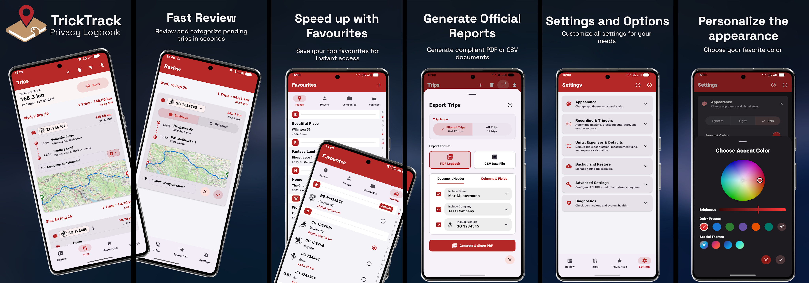

    
    &nbsp;&nbsp;
    

**TrickTrack** is a smart, automated GPS mileage tracker for Android built with modern Jetpack Compose. It automatically detects when you are driving — either via Bluetooth / Android Auto connection or movement activity — and logs your trips effortlessly. Designed from the ground up for privacy, battery efficiency, and offline resilience.

---

## 📑 Table of Contents

* [✨ Key Features](#-key-features)
* [💡 Motivation](#-motivation)
* [🛠️ Tech Stack](#%EF%B8%8F-tech-stack)
* [🚀 Installation & Setup](#-installation--setup)
* [📸 Usage](#-usage)
* [📖 Help](#-help)
* [ℹ️ Disclaimer & Development Status](#%EF%B8%8F-disclaimer--development-status)
* [⚖️ License & Attribution](#%EF%B8%8F-license--attribution)
---

## ✨ Key Features

### 🧠 Smart Automation
* **Bluetooth & Android Auto Triggers:** Automatically starts and stops tracking when connecting to Android Auto or selected vehicle Bluetooth devices.
* **Activity Recognition:** Detects vehicle movement automatically and starts recording when driving begins.
* **Stillness Detection & Speed Threshold:** Intelligently stops trips when parked with a customizable stillness timer (in seconds) and minimum speed thresholds (km/h or mph).
* **Automated Tracking Schedule:** Restrict automatic tracking to specific days or hours (e.g., work hours). Set default trip classifications (Business vs. Personal) and target triggers (Bluetooth, Activity, or Both) per schedule.
* **Smart Location Snapping:** Automatically detects and snaps start and end destinations to your saved **Favorites** within a customizable radius (in meters or feet).
* **Odometer Mode:** Support for recording trips via vehicle odometer readings.

### 📍 Accurate & Offline-First Tracking
* **Foreground Service:** Ensures rock-solid background tracking with live distance updates directly in the notification shade.
* **100% Offline Resilience:** Fully logs trips and routes even when driving through areas without cell reception or internet connectivity.
* **Interactive Route Maps:** View recorded trips and calculated driving routes with polylines and start/end markers powered by **OpenStreetMap** (via **osmdroid**).
* **Smart Geocoding Suggestions:** Converts coordinates into descriptive location and business names using the **Photon API (OpenStreetMap)**.
* **Accurate Route Calculation:** Route distance calculation and routing polyline generation via **OSRM (Open Source Routing Machine)**.
* **Multiple Measurement Units:** Full support for Kilometers (km), Miles (mi), and Nautical Miles (NM ⚓).

### 💰 Reporting, Expenses & Filtering
* **Expense Tracking:** Automatically calculates trip costs and reimbursement amounts based on custom rates per unit and currency.
* **Advanced Filtering:** Instant filtering by date ranges, keywords, or trip type (Business / Personal).
* **Export Options:** Export detailed trip logs to **PDF** (featuring customizable fields and car logo header branding) or **CSV/Excel** for tax returns and employer reimbursement.
* **Contextual Inline Help:** Embedded help cards and tooltips in Settings, Filter, and Export dialogs for quick in-app assistance.

### 🔒 Data Privacy & Diagnostics
* **100% Local Data:** All trips and favorites are stored locally in an on-device Room database. No user accounts, no analytics, no third-party trackers, and no mandatory cloud servers.
* **Automated & Manual Backups:** Schedule automatic backups (Daily, Weekly, Monthly) to any folder on your device, with one-tap manual backup and restore.
* **Self-Hostable Endpoints:** Freely configure custom URLs for both OSRM (Routing) and Photon (Geocoding) in Advanced Settings.
* **Diagnostics & Debugging:** In-app permissions health check and one-click debug log viewer & export.

### 🎨 Design & Theming
* **Material 3 & Edge-to-Edge:** Modern, fluid UI supporting Android's latest edge-to-edge standards.
* **Custom Theming:** System, Light, and Dark modes, custom accent color picker, and gradient themes.
* **Adaptive Map Theming:** Choose Light, Dark, or Auto map styles (featuring a custom high-contrast dark palette designed for night driving).
* **Winter Mode:** Optional seasonal snowfall visual effect.

### 🌍 Translation & Localization

TrickTrack is built with multi-language support in mind:

| Language          | Status                           |
|:------------------|:---------------------------------|
| 🇺🇸 **English**  | ✅ Complete                       |
| 🇩🇪 **German**   | ✅ Complete                       |
| 🇫🇷 **French**   | ⚠️ Complete (machine-translated) |
| 🇮🇹 **Italian**  | ⚠️ Complete (machine-translated) |

*Missing your language? Contributions are welcome! Feel free to open a Pull Request.*

<b>🛠️ Want to help translate? Click here</b>

1.  Open `app/src/main/res/values/strings.xml` (English source).
2.  Create a new values folder for your language (e.g., `values-fr` for French).
3.  Copy the strings and translate them.
4.  Submit a Pull Request!

---

## 💡 Motivation
The inspiration for this project came from using apps like *Driversnote*. While they are excellent products, I found myself frustrated by a few specific limitations that I wanted to solve for my own daily use:

* **🔋 Battery Efficiency:** Existing solutions often drained my battery significantly. I wanted an app that was lighter on resources.
* **🚫 No Arbitrary Limits:** The standard "15 free trips per month" wasn't enough, and I believe basic tracking shouldn't require a subscription.
* **🔒 Privacy First:** I did not want to create a mandatory user account or be forced to sync my location history to a cloud server. Your data stays on your device!
* **🚙 Native Hardware:** Modern cars already have Bluetooth and Android Auto. I didn't see the need to buy a proprietary "Beacon" when the phone can simply detect the car's existing connection.
---

## 🛠️ Tech Stack

* **Language:** [Kotlin](https://kotlinlang.org/) (100%)
* **UI:** [Jetpack Compose](https://developer.android.com/jetpack/compose) (Material 3), Navigation Compose
* **Architecture:** MVVM (Model-View-ViewModel) with Coroutines & StateFlow
* **Dependency Injection:** [Hilt](https://dagger.dev/hilt/)
* **Local Data:**
    * **Room Database:** For storing trips and favorites.
    * **DataStore & SharedPreferences:** For user preferences and application settings.
* **Location, Maps & Routing:**
    * **Android Location Services (FusedLocationProviderClient):** For GPS tracking.
    * **osmdroid:** OpenStreetMap tile rendering and route polyline overlays.
    * **OSRM (Open Source Routing Machine):** Distance calculation and route geometry (self-hostable).
    * **Photon API:** Address search and geocoding suggestions (self-hostable).
* **Networking:**
    * **OkHttp:** Lightweight HTTP client for geocoding and routing endpoints.
* **Background Processing:**
    * **WorkManager:** For automated scheduled backups and background maintenance.
    * **Foreground Services:** For persistent, uninterrupted trip recording.

---

## 🚀 Installation & Setup

1. **Google Play Store:** Install directly from [Google Play](https://play.google.com/store/apps/details?id=ch.opum.tricktrack).
2. **GitHub Releases:** Download the latest signed APK from the [Releases](https://github.com/OPUM-LABS/TrickTrack/releases) page.

> [!WARNING]
> **Compatibility Note (Signing Keys):**
> Builds from the **Google Play Store** and **GitHub Releases** are signed with different keys and cannot be installed over each other as a direct update.
> If you plan to switch between the GitHub and Google Play versions, you must uninstall the currently installed version first. **Always create a backup in Settings > Backup and Restore before switching or uninstalling**, so you can seamlessly restore your trips and favorites in the new installation.

---

## 📸 Usage

1. **Permissions:** Grant Location permissions ("Allow all the time" recommended for automatic tracking) and Notification permissions on first launch.
2. **Settings:**
    * Connect your **Bluetooth Device** (Car) or enable **Android Auto** auto-start.
    * Set your **Schedule** if you wish to track only during specific work hours or set default trip classifications.
    * Add your frequent places to **Favorites** to enable Smart Location Snapping.
3. **Manual Trip:** Tap the "Start" button on the home screen to begin recording a trip manually, or add a trip retroactively with map route recalculation.
4. **Auto Trip:** Just drive! The app handles start, tracking, and parking detection automatically.

---

## 📖 Help
Use the built-in inline help cards directly within the app settings, filter, and export dialogs.

---

## ℹ️ Disclaimer & Development Status

**TrickTrack** is a personal hobby project created to solve a specific need: privacy-focused, automated mileage tracking.

* **AI-Assisted Development:** Due to strict time constraints and to bridge the gap in native Android development knowledge, this application was written with assistance from **Google Gemini**.
* **Maintenance:** As this is a side project maintained alongside a full-time job and family commitments, **development speed is limited**.
* **Support:** This app is primarily built for personal use. While I welcome issues and pull requests, please expect a "hobbyist" pace for updates, features, and bug fixes.

---

## ⚖️ License & Attribution

This project is licensed under the GPLv3 License - see the [LICENSE](LICENSE) file for details.

* **Map Data & Tiles:** © [OpenStreetMap contributors](https://www.openstreetmap.org/copyright).
* **Map Renderer:** [osmdroid](https://github.com/osmdroid/osmdroid).
* **Geocoding:** Powered by [Photon](https://github.com/komoot/photon).
* **Routing:** Powered by [OSRM](https://project-osrm.org/).

---

Made with ❤️ using Kotlin & Jetpack Compose.